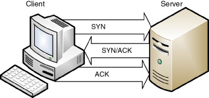
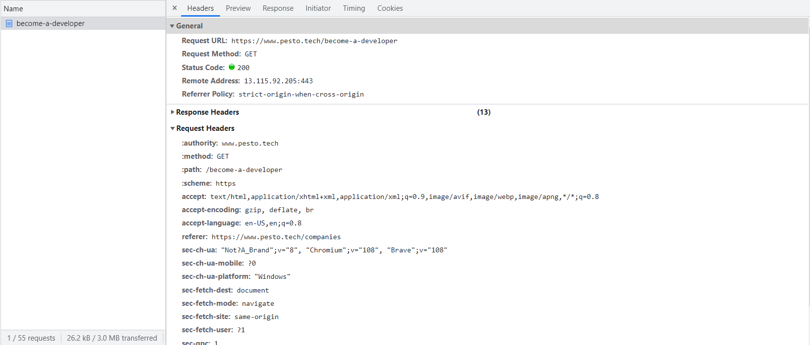

# How Does A Browser Works Under The Hood

The main functionality of a browser is to fetch the requested information/data from across the internet to your screen(desktop, mobile, etc.). World Wide Web is huge repository of data across the world which gets transmitted over HTTP - Hyper Text Transfer Protocol, and browser plays an important role on fetching all that data and present it to you in a human readable format.

## Components of a Browser

Before diving deep into how a browser works under the hood, we first need to understand its component. So, lets have a look at high level component of browsers:

1. **The user interface**: This is the interative part of browser including sub components like address bar, forward and back button, bookmark option, home button, etc. Everything on a browser except the part where the requested resource is displayed.
2. **The browser engine**: The browser engine helps in performing all the actions between a user interface and a rendering engine
3. **The rendering engine**: This engine is responsible for rendering requested resource which can be HTML, pdf, or an image. In case of HTML content, the rendering engine parses HTML and CSS and displays the data withe the help of Layout and Painting process.
4. **Networking**: This component is responsible for making TCP connection, and network calls like http requests
5. **UI backend**: This component helps in painting the render tree. This is used for drawing widgets like windows and combo-boxes.
6. **JavaScript interpreter**: This component parses and executes javascript.
7. **Data storage**: This is browser's persistence layer which stores data locally in cookies, local storage or session storage.

Refer to figure 1 to visualize the role of these browser components amongst each other.

<figure>

  <figcaption style="text-align:center">figure 1 - Browser Components</figcaption>
</figure>

let's deep dive into these components with an example - What happens when a user enters a URL in the browser

## What happens when a user enters a URL in the browser address bar

When a user enters a URL there are a lot of process that happens behind the scenes which fetches the desired results. Lets try to understand it step by step.

1. DNS Lookup - Browser checks for DNS(Domain Name System) entry in cache to find the IP address of the URL.
2. TCP Connection - Browser Initiates a TCP Connection.
3. HTTP Request - After successful TCP connection, browser sends an HTTP request to hosting server.
4. Response - Server handles the request and sends back a response to the browser
5. Rendering - Browser renders the content based on the received response. This is the final stage where the actual magic happens.

Refer to the below diagram for the visualization of the above steps:

<figure>

  <figcaption style="text-align:center">figure 2 - Flow of how a browser converts URL to a webpage</figcaption>
</figure>

Let's deep dive into each of the above step and understand how it works.

### **DNS Lookup**

First, user types in a URL(Uniform Resource Locator) let's say <a href="https://pesto.tech">https://pesto.tech</a>, which is an alias for the IP address of the server which hosts the files of the website we are looking for.
Once the user presses enter, the browser will start looking for an DNS(Domain Name System) entry for the typed URL. Initially it would check in the below 4 caches in order until found:

1. Browser cache
2. Operating System cache
3. Router cache
4. ISP cache

Each of the above 4 caches maintains some DNS records of its own for the websites previously visited. These records are in pair of the URL and the IP address of the website it links to.

In case the entry is not found in any of the 4 caches, the ISP's DNS server then initiate a recursive DNS query to find the IP address of the URL.

Once the browser finds the IP address of the server, then it starts to establish a connection with it.

### **Browser Initiates the TCP connection with server**

Once the correct IP address is found, browser starts to build a connection with the server to transfer the information.

These connections are established via **Transport Layer** using internet protocols such as TCP connection, which is the most common protocol used for http requests.

Let's have a quick quick look at how does a TCP connection works:

1. Browser(client) sends a **SYN** packet to server to check if its open for connection
2. If the server has open ports that can accept new connections, server would send an Acknowledgement with **SYN-ACK** packet to the client.
3. Browser on receiving the SYN-ACK packet will respond with **ACK** packet to establish the connection.

If the request is HTTPS then a **TLS**(Transport Layer Security) handshake is mandatory to encrypt the contents that will be transferred over this connection.

<figure>

  <figcaption style="text-align:center">figure 3 - TCP connection diagram</figcaption>
</figure>

### **Browser sends the HTTP request to the server**

Now that the connection is established between browser and server, browser sends an HTTP(s) request to the server to request the content of the webpage.
This HTTP(s) request contains a request lin, Header, and a body. this metadata helps the server understand what type of content is requested.

Request line consists of:

1. Request method(GET,POST,PUT,DELETE, etc.)
2. Path that points to the requested resource.
3. the HTTP version to communicate with

Example - GET /become-a-developer HTTP/1.1

### **The server handles the request and sends back a response**

The server contains some webserver such as Apache, nginx etc. that receives the request and passes it on to a request handler.

This request handler is a program written in any backend language (Java, Ruby, etc.) which then creates a proper response to be sent back to the client.

The response contains the following:

1. A status line, telling the client the status of the request(like status 200 stands for OK response)
2. Response Headers, telling the browser how to handle the response
3. The requested resource at that path, can be in format of HTML, XML, JSON, etc.

You can see this information in the network section of a browser developer tools.

<figure>

  <figcaption style="text-align:center">figure 4 - Request Response in Network section of Developer Tools</figcaption>
</figure>

This response is now sent to the browser and now browser will handle the next steps.

### **Browser renders the content - Rendering**

Once the browser receives the response from server, it starts inspecting the response header for the information on how to handle the response.
The **Content-Type** header tells the browser that the recource is an HTML document.

This is where one of the most important step of Rendering comes into the picture. We will look a little deep into Rendering now.

## Rendering

Rendering is the process of displaying the requested content on the browser screen. This process is done by Rendering Engine. By default rendering engine can display HTML and XML contents, but with the help of plug ins and extensions it can also display PDF and Image resources.

Let's see how a Rendering Engine works.

## Rendering Engine

Different Browsers have different Rendering Engines, some of them used by the most popular broswers are listed below:

1. **Webkit** - An open source Rendering Engine used by Safari
2. **Blink** - a fork of Webkit, used by chrome and opera
3. **Gecko** - used by firfox
4. **Trident** - used by Internet Explrer

## The Main Flow of Rendering Engines

Rendering Engine gets the requested contents from **Networking Layer** as a response from server. This content is usually received in 8kB chunks.

Let's have a look at the flow of the rendering engine:

<figure>

  <figcaption style="text-align:center">figure 5 - The flow of a Rendering Engine</figcaption>
</figure>

1. Rendering Engine starts parsing the HTML document tp create a **DOM Tree** or **Content Tree**. The engine will also parse the CSS (inline, embedded and external) and convert it to style rules.
2. Styling rules and visual information in DOM tree would be used to create the **Render Tree**.
3. After the construction of Render Tree, it goes through **Layout** process. This is where each elements receives exact cordinates on where it would appear on screen.
4. The final stage is painting, where each node element will be painted on the screen using the **UI Backend**.

Refer to figure 6 for the main flow of Webkit rendering engine as an example:

<figure>

  <figcaption style="text-align:center">figure 6 - Main flow of Webkit</figcaption>
</figure>

Now let's try to understand each step in more detail.

## Parsing

In general, parsing a document means translating it into a format wich code can use. The result is usually a tree of nodes that represent the structure of the document. That is why the result is also called a parse tree.

### Grammer

Parsing is based on syntax rules that a document obeys. Every format that is to be parsed must have a deterministic grammer consisting of vocabulary and syntax rules, its called **context free grammer**.

HTML does not follow context-free-grammer while CSS does.

### Parser Lexer Combination

Parsing can be further subdivided into two subprocess:

1. **Lexical Analysis**: The process of breaking input into tokens, that is why **Lexer** is sometimes called the Tokenizer.
2. **Syntax Analysis**: The process of applying the language syntax rules. Thus, the **Parser** is responsible for constructing the parse tree by analyzing the document structure according the language syntax rules.

<figure>

  <figcaption style="text-align:center">figure 7 - Parser Lexer Combination</figcaption>
</figure>

## HTML Parser

The responsibility of HTML parser is to parse HTML Documents. The vocabulary and syntax rules of HTML are defined by W3C organization.

However, HTML cannot be defined by a **context free grammer**, since HTML approach is more **forgiving**. That's why conventional parser cannot parse HTML.

HTML has a defined formal format known as **HTML-DTD(Document Type Definition)**. This format contains the definition of all the elements, their attributes and heirarchy.

## DOM - Document Object Model

In case of HTML, the parse tree is a **DOM tree** consisting of element and attribute nodes. The root of the tree is **Document** object. DOM is also specified by W3C organization.

## HTML Parsing Algorithm

As mentioned earlier, HTML defination is not a context free grammer and that's why it cannot be parsed with conventional parsers.

HTML parsing algorithm consists of two stages:

1. Tokenization
2. Tree Construction

## Tokenization Algorithm

The output of this algorithm is an HTML token. The algorithm can be expressed as a state machine. Lets try to understand with a basic example.

    <html>
      <body>
        Hello world
      </body>
    </html>

The initial state is **"Data state"**. When **">"** character is encountered,the state changes to **"Tag open state"**. consuming a-z characters causes creation of a "start tag token", the state is changed to **"Tag name state"**, this state is continued till we encounter **">"** character, this is when the current token is emitted, in our case it is **html** token.

Once again the state changes to **"Data state"**. The `<body>` tag will be created in the same way as above. So far, html and body tags are emitted.
Consuming **H** character in **Hello World** will cause creation and emitting of a character token until **<** of `</body>` is encountered. We are now back to **"Tag open state"**. consuming **"/"** will cause creation of "end tag token" and a move to **"Tag name state"** until we reach **">"**. The body tag will be emitted and we go back to **"Data state"**. In similar manner the final token `</html>` tag will be emitted.

<figure>

  <figcaption style="text-align:center">figure 8 - Tokenization Algorithm</figcaption>
</figure>

## Tree Construction

During the tree construction stage the DOM tree would be modified with Document at its root. Each node emitted from tokenizer algorithm will be processed by it.

Let's continue with the example from tokenizer for the tree construction

    <html>
      <body>
        Hello world
      </body>
    </html>

The input for this algorithm will be the tokens from tokenizer stage. The first mode is **"initial mode"**. Then the **html** token is received and the state changes to **"before html"** mode and reprocessing of the token in that mode happens. This will cause the creation of **HTMLHtmlElement** and it will be appeneded to the root Document object.

The state will now change to **"beforeHead"**. the **"body"** token is received. This will cause the creation of HTMLHeadElement implicitly although we don't have a "head" token and it will be added to the tree.
We now move to **"in head"** and then to **"after head"**.

the **"body"** token is reprocess and an HTMLBodyElement is created and added to the tree. The state now changes to **"in body"**.

The character token of **"Hello World"** are now received. The first token will cause creation of a **"Text"** element and the rest of the characters are appended to that node.

The receiving of "body end token" will change the state to **"after body"** mode. And the receiving of "html end token" will change the state to **"after after body"** mode. The end of the token will end the parsing.

<figure>

  <figcaption style="text-align:center">figure 9 - Tree construction Algorithm</figcaption>
</figure>

## CSS Parsing

CSS is a context free grammer and can be parsed using conventional Top down or Bottom up Parsers. Conventional parsing consists of 2 components as discussed earlier.

1. Lexical Grammer - Vocabulary defined by regular expression for each token

```
    comment:   \/\*[^*]*\*+([^/*][^*]*\*+)*\/<br>
    num       [0-9]+|[0-9]*"."[0-9]+<br>
    nonascii  [\200-\377]<br>
    nmstart   [_a-z]|{nonascii}|{escape}<br>
    nmchar    [_a-z0-9-]|{nonascii}|{escape}<br>
    name      {nmchar}+<br>
    ident     {nmstart}{nmchar}*<br>
```

"ident" is short for identifier, like a class name. "name" is an element id (that is referred by "#" )

2. Language Syntax Rules: Described in BNF(Backus Naur Form notation)

```
    ruleset
      : selector [ ',' S* selector ]*
      '{' S* declaration [ ';' S* declaration ]* '}' S*
      ;
    selector
      : simple_selector [ combinator selector | S+ [ combinator? selector ]? ]?
      ;
    simple_selector
      : element_name [ HASH | class | attrib | pseudo ]*
      | [ HASH | class | attrib | pseudo ]+
      ;
    class
      : '.' IDENT
      ;
    element_name
      : IDENT | '*'
      ;
    attrib
      : '[' S* IDENT S* [ [ '=' | INCLUDES | DASHMATCH ] S*
        [ IDENT | STRING ] S* ] ']'
      ;
    pseudo
      : ':' [ IDENT | FUNCTION S* [IDENT S*] ')' ]
      ;
```

Let's take an example:

```
div.error, a.error {
  color:red;
  font-weight:bold;
}
```

here, there are two selectors - div.error and a.error. The part enclosed in the curly braces is the rules that are applied by this ruleset. The structure is define formally in this definition.

```
ruleset
  : selector [ ',' S* selector ]*
    '{' S* declaration [ ';' S* declaration ]* '}' S*
  ;
```

This means a ruleset is a selector or more than one selector seperated by a "," or spaces(S). A ruleset contains the curly braces enclosing one or more declaration seperated by a semicolon.

## Order of processing Scripts and style sheets

### **Scripts**

The model of the web is synchronous. Authors expects scripts to be parsed and executed as soon the parser reaches the `<script>` tag. This will halt the parsing of the document util the script is completely parsed and executed. If the script is external then the parser will halt the parsing of the document until the script is fetched from the external source.

This has been the model for many years now. Author can give **defer** attribute to the `<script>`, in which case the parser will not halt the document parsing. In HTML5, you can mark the script as asynchronous so it will be parsed and executed by a different thread.

### **Style Sheets**

Style sheets have a diffent model. Since style sheets don't change the DOM tree, there is no reason to halt the document parsing. However, there is an edge case, when a script sometime asks for a style information and if the style sheet is not parsed it would give incorrect information which would caus a lot of problem.

To overcome this issue, Firefox blocks all scripts while parsing the style sheets, whereas webkit blocks script only when they try to access any certain style properties that may be affected due to unloaded style sheets.

## Render tree construction

After the construction of the DOM tree, the browser creates another tree, the Render Tree. This tree consists of visual elements in order in which they will be painted. The elements of the render tree are also called as the rendere or render object for webkit rendering engines.

Each rendere represents a rectangular box corresponding to css box model, defined in CSS2. It includes information like width, height and position.

<figure>

  <figcaption style="text-align:center">figure 9 - DOM Tree to Render tree Relation</figcaption>
</figure>

## Layout

The renderer is created, however it still does not have a position or size. Calculating these values is called Layout.

Layout gives exact coordinates to each renderer on where they would be displayed on the screen. Layout is a recursive process. It begins at the root renderer, `<html>` element of the HTML Document and continues recursively through each frame heirarchy computing geometric information for each renderer.

### The layout process

1. Parent renderer determines its own width
2. Parent goes over children:

   1. Place the child renderer (sets its x and y cordinates)
   2. Calls child's layout which calculate its own width

3. Parent sets its own height by using children's accumulative height and heights of margin and padding. This would recursively used for parent renderer's parent.
4. Sets its dirty bit to false.(dirty bit true means it needs a full layout, parent sets it to false to avoid layout call)

## Painting

In Painting stage the render tree is traversed and the renderer's **"paint()"** method is called to display the content on the screen. UI backend component is responsible for this process.

CSS2 defines the painting order. This is actually in order in which the elements are stacked in the stacking contexts. The stacking order of a block renderer is:

1. background color
2. background image
3. border
4. children
5. outline

This is how a string of URL is converted into a webpage.

### **Resources**

1. https://web.dev/howbrowserswork/#render-tree-construction
2. https://aws.amazon.com/blogs/mobile/what-happens-when-you-type-a-url-into-your-browser/
3. https://medium.com/@maneesa/what-happens-when-you-type-an-url-in-the-browser-and-press-enter-bb0aa2449c1a
