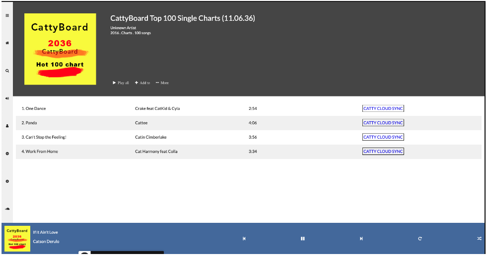
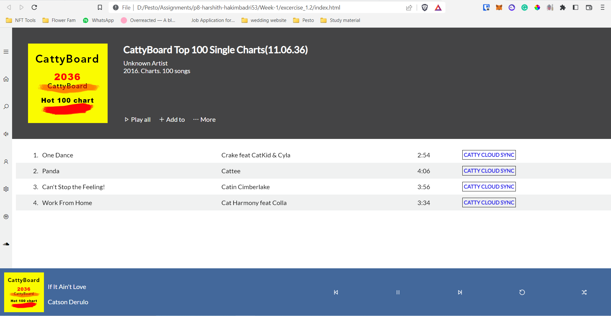

# Catty Board Playlist HTML Assignment

### Assignment details

Exercise1.2:(2-3hours)-

- Use "Lato" font for entire text in UI
- Use line awesome Icon library for all icons
- Cattyboard album image URL:https://vif1g.csb.app/src/assets/cattyboard.jpg
  
- Icons used in assignment:
  - la-bars
  - la-home
  - la-search
  - la-volume-up
  - la-user
  - la-cog
  - la-spotify
  - la-soundcloud
  - la-play
  - la-plus
  - la-ellipsis-h
  - la-step-backward
  - la-step-forward
  - la-undo-alt
  - la-random
- Note: Feel free to use any other font library if you wish
  

Guidelines:1.There should be a separate branch created in GitHub for this exercise.2.The UI should closely match with the screengrab given as sample. This includes thecolors, fonts, icons, text etc.3.Semantic tags should be used for laying out the UI.4.There should be one or more Git commits with meaningful commit messages.

## Demo Screenshot

## Installing

clone the repo and open the index.html file to view the webpage.

## Tech Stack

1. HTML
2. CSS
